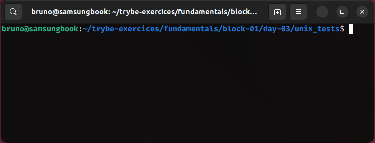
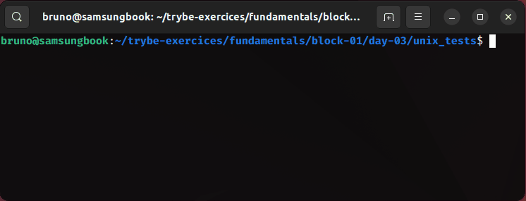
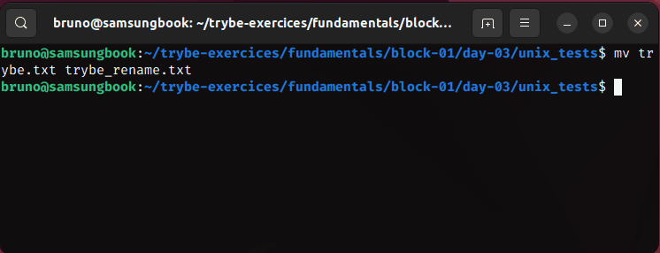
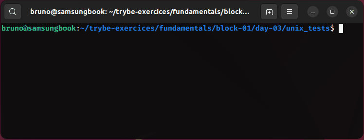
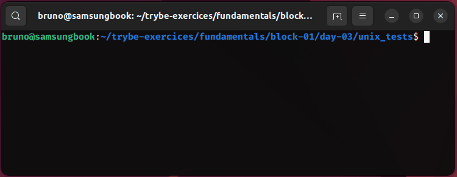
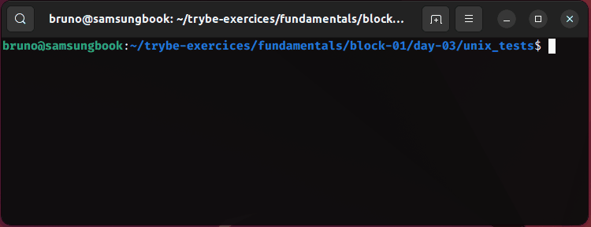
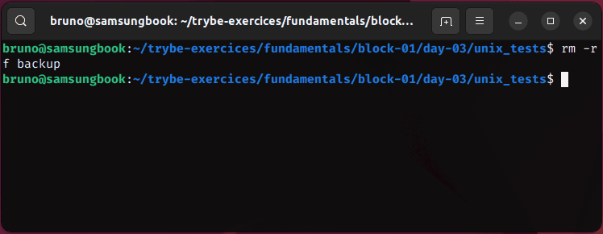

# unix e bash

1. Utilizando o terminal, aplique o comando de criação de diretórios que você aprendeu, crie um diretório chamado `unix_tests` e navegue até ele.
   


```bash
mkdir unix_tests
cd unix_tests
```

2. Crie um arquivo de texto com o nome `trybe.txt`.



```bash
touch trybe.txt
```

3. Crie uma cópia do arquivo `trybe.txt` com nome `trybe_backup.txt`.

![image3]commands/3.gif)

```bash
cp trybe.txt trybe_backup.txt
```

4. Renomeie o arquivo `trybe.txt`.



```bash
mv trybe.txt trybe_rename.txt
```

5. Dentro de `unix_tests`, crie um novo diretório chamado `backup`.



```bash
mkdir backup
```

6. Mova o arquivo `trybe_backup.txt` para o diretório `backup`.



```bash
mv trybe_backup.txt backup
```

7. Dentro de `unix_tests`, crie um novo diretório chamado `backup2`.



```bash
mkdir backup2
```

8. Mova o arquivo `trybe_backup.txt` da pasta `backup` para a pasta `backup2`.


```bash
cd backup
mv trybe_backup.txt ../backup2
```

9. Apague a pasta `backup`.



```bash
cd ..
rmdir backup
```

10. Renomeie a pasta `backup2` para `backup`.


```bash
mv backup2 backup
```

11. Veja qual o path completo do diretório atual e liste todos os arquivos dentro dele.


```bash
pwd
ls -a
```

12. Apague o diretório `backup`.


```bash
rm -rf backup
```

13. Limpe o terminal.



```bash
clear
```
